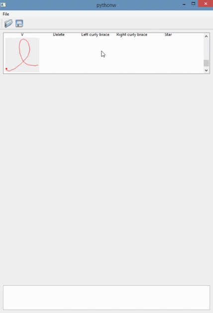

# Interaction Homme-Machine : Interaction gestuelle

Les objectifs du projets sont de se familiariser avec le système de reconnaissance $1 recognizer, de développer une plateforme pour tester ce système de reconnaissance de gestes et de développer une méthode de feedback pour guider l’exécution du geste.

## Travail effectué
Réalisation d'une interface permettant à l’utilisateur de charger et afficher le vocabulaire de gestes; de dessiner un geste et de tester la capacité du 1$ recognizer à reconnaitre les gestes; et de le guider dans l'exécution du geste (avec un feedback dynamique : morphing).

 L’interface contient une galerie de templates (en haut), une zone pour tester le système de reconnaissance (au centre) et une zone de texte affichant l’historique des gestes reconnus.
 
 
